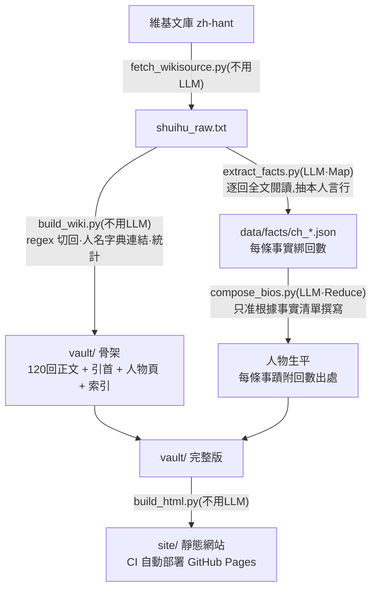

# 水滸傳 Wiki

把一本《水滸傳》(120 回本)原文(維基文庫),自動變成可瀏覽、可查證的 wiki 資料庫。
姊妹作:[西遊記 Wiki](https://github.com/pondahai/xiyouji-wiki)、
[三國演義 Wiki](https://github.com/pondahai/sanguo-wiki)、
[封神演義 Wiki](https://github.com/pondahai/fengshen-wiki)(方法論與開發歷程詳見三國版 README)。

全書 120 回正文自動切分、人名自動連結,主要人物各有條目——生平由本地 LLM
以 map-reduce 方式「全文閱讀」原著後生成,**每條事蹟都附回數出處,可回溯查證**。

- **Obsidian vault**(`vault/`):`[[人名]]` 點擊跳轉,graph view 看人物關係網
- **靜態網站**:線上直接看 <https://pondahai.github.io/shuihu-wiki/>,
  push 後由 CI 自動從 vault 重建部署 GitHub Pages;
  也可本地跑 `python scripts/build_html.py` 後開 `site/index.html` 離線瀏覽

## 與封神演義版的差異

本 repo 直接複製 [fengshen-wiki](https://github.com/pondahai/fengshen-wiki)(config 化架構),
只改了 `scripts/config.py` 與 `scripts/characters.py`,並調整 `fetch_wikisource.py`
的頁面命名(維基文庫 120 回本分卷頁是
[水滸傳\_(120回本)/第001回](https://zh.wikisource.org/zh-hant/水滸傳_(120回本)/第001回) 這種格式)。

另外兩點:

- 水滸的回目是上下聯(「第一回 張天師祈禳瘟疫 洪太尉誤走妖魔」),
  `HEADING` regex 用兩個標題群組,`build_wiki.py` 自動串接
- 120 回本第一回之前有「引首」卷首文字,`fetch_wikisource.py` 一併抓取,
  `build_wiki.py` 新增通用的卷首支援(`config.PREFACE_TITLE`),輸出成獨立頁面

## 處理流程



核心原則:
**能用純程式做的絕不用 LLM;必須用 LLM 的,餵齊資料、禁止腦補、要求出處,
然後在它的輸出後面再放一層程式檢查。**

## 快速開始

需要 Python 3(標準庫即可)與一個 OpenAI 相容的 LLM 端點(設定在 `scripts/config.py`)。

```bash
python scripts/fetch_wikisource.py   # 0. 維基文庫 → data/shuihu_raw.txt(分鐘級)
python scripts/build_wiki.py         # 1. 切章回 + 人名連結 + 人物頁/索引(秒級)
python scripts/extract_facts.py      # 2. Map:逐回全文餵 LLM,抽結構化事實(數小時)
python scripts/compose_bios.py       # 3. Reduce:依事實清單撰寫人物生平
python scripts/build_html.py         # 4. vault → site 靜態網站(秒級)
```

每一步都可中斷重跑:已完成的章回與人物自動跳過。

## 換一本書

1. 複製本 repo
2. 改 `scripts/config.py`:書名、回數、原文檔名、(必要時)章回標題 regex、LLM 端點
3. 換掉 `scripts/characters.py` 的人物表
4. 原文轉成「回目標題獨立一行、每段一行且以全形空格開頭」的純文字
   (維基文庫來源可直接改 `fetch_wikisource.py` 的書名與卷頁命名)
5. 照跑四步

## 專案結構

```
scripts/config.py     全書設定(換書改這裡)
scripts/characters.py 人物表:正名 + 別名(換書改這裡)
scripts/*.py          流水線:fetch_wikisource → build_wiki → extract_facts → compose_bios → build_html
data/shuihu_raw.txt   原文純文字
data/facts/           逐回事實清單(map 產物,生平的可查證來源)
vault/                Obsidian vault(引首、回目/、人物/、索引)
site/                 靜態 HTML(本地生成,不入 repo;CI 自動建置部署)
```

## 授權

《水滸傳》原文為公有領域;文字取自[維基文庫](https://zh.wikisource.org/zh-hant/水滸傳_(120回本))。腳本部分隨意使用。
